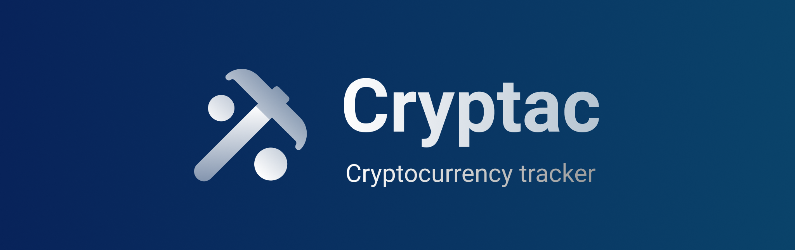

# What is it? 🤔

**Cryptac** is a mobile application that allows you to track the main important information about
your favorite cryptos. It is currently available only on Android (> 10).


## Screenshots


# Tech Stack 🛠

- Language: [Kotlin](https://kotlinlang.org/) (❤️)
- Architecture: [MVVM](https://en.wikipedia.org/wiki/Model%E2%80%93view%E2%80%93viewmodel)
- Database: [Room](https://developer.android.com/jetpack/androidx/releases/room)
- HTTP client: [Retrofit](https://square.github.io/retrofit/)
- Other: [RxJava](https://github.com/ReactiveX/RxJava), [SwipeRefreshLayout](https://developer.android.com/jetpack/androidx/releases/swiperefreshlayout), [Glide](https://github.com/bumptech/glide), [Gson](https://github.com/google/gson)

# Setup the project 🔄

1. Clone the repository.
2. Add the `CMC_API_KEY` variable to the `local.properties` file in the root folder. This
corresponds to your [CoinMarketCap](https://coinmarketcap.com/api) API key.

```properties
CMC_API_KEY=my-secret-api-key
```

3. You're all set! ✨

# Continuous Integration 🧪

This project uses GitLab CI to ensure the project always compiles correctly, and the codestyle is
respected. As a result, the two steps of the CI are:

1. Lint (using [ktlint](https://github.com/pinterest/ktlint))
2. Compile (Gradle assemble command)
